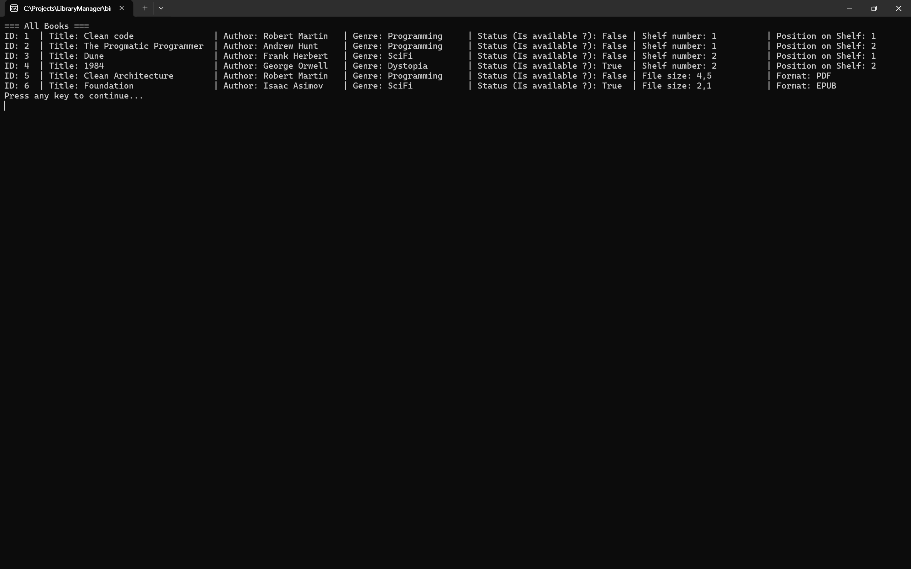
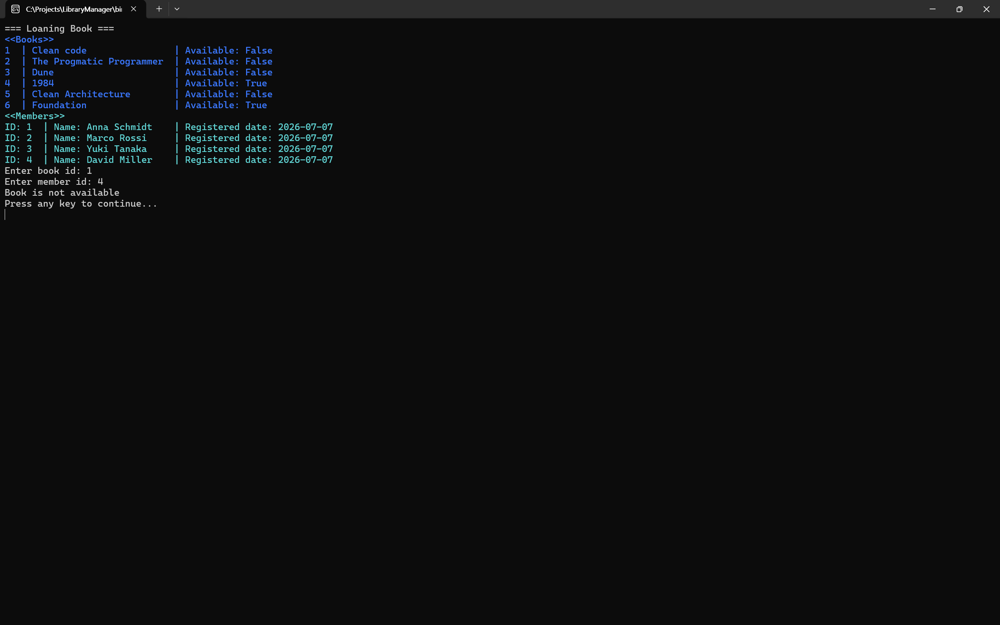
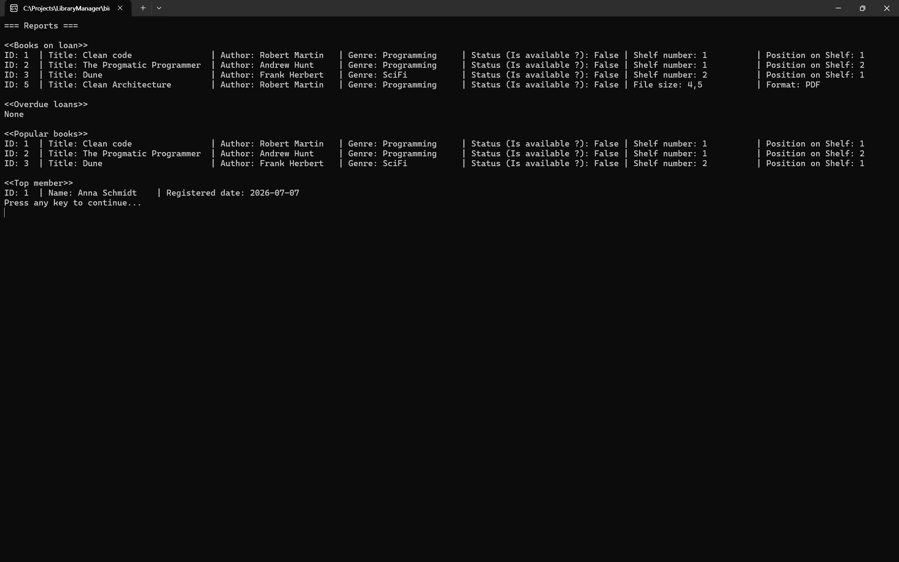
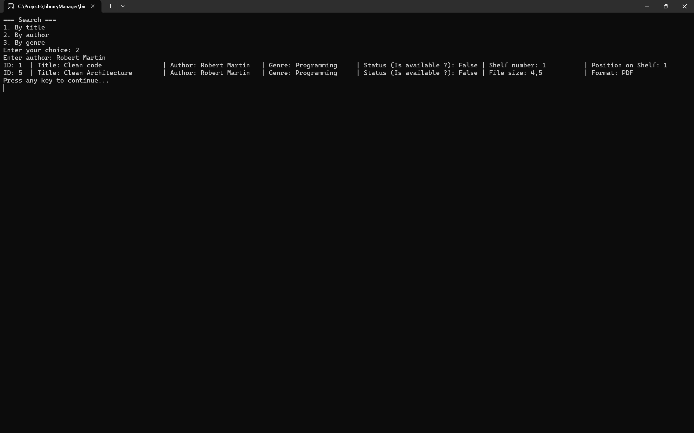
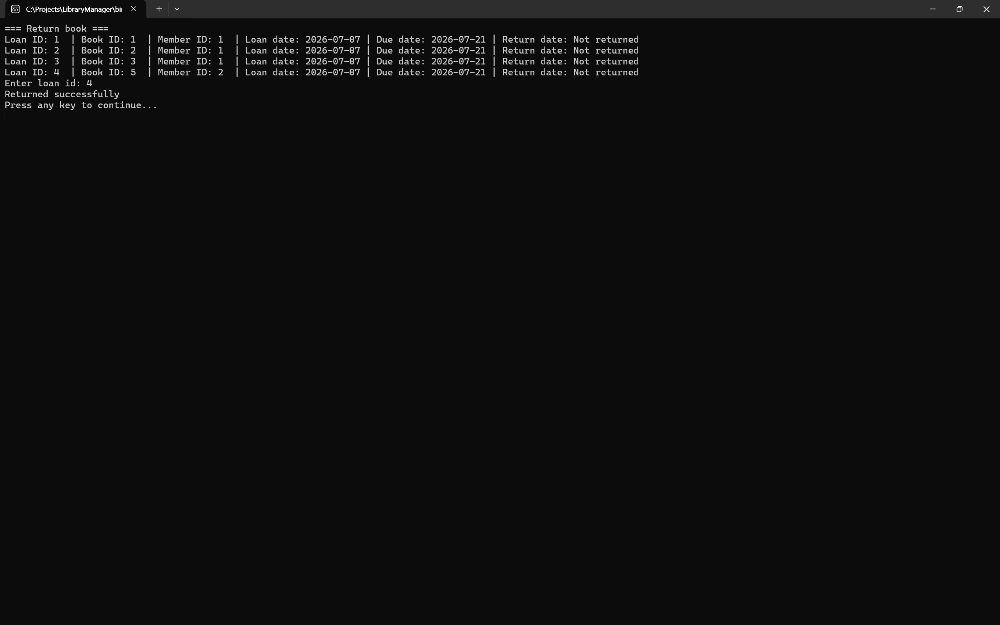

# Library Manager

Console application for library management: book catalog, readers, book loans and returns, and reports.
Written in C# / .NET.


## Features

- Book catalog with two book types (paper and electronic)
- Member registration
- Book lending with validation (availability, borrowing limit)
- Book returns
- Reports (books on loan, overdue loans, popular books, top member)
- Search books by title, author, or genre
- Data persistence between runs via JSON

## Concepts & Technologies

- **OOP**: inheritance (abstract `Book` → `PaperBook`/`EBook`), polymorphism, encapsulation
- **LINQ**: filtering, grouping, aggregation for search and reports
- **Generics & collections**: `List<T>`, `IEnumerable<T>`
- **Nullable reference types**: safe handling of missing data
- **Enums**: typed operation results (`LoanResult`, `ReturnResult`)
- **JSON serialization**: including polymorphic (de)serialization of book types
- **Exception handling**: safe error handling with `try/catch` for files, JSON, and invalid operations
- **.NET 10/ C#** 

## Screenshots

### All books


### Lending — book not available


### Lending — loan limit reached


### Reports


### Search by author


### Return — already returned / success



## How to Run

1. Clone the repository: ```git clone https://github.com/B-Saidafzalkhon/Library-Manager.git```
2. Open the solution in Visual Studio (or use the .NET CLI).
3. Run the project (```dotnet run``` / ctrl + f5).


## Project Structure
```
Storage/
    └── library.json  — data storage
LibraryManager/
    ├── Models/       — entities (Book, PaperBook, EBook, Member, Loan, LibraryData)
    ├── Services/     — business logic (LibraryService)
    ├── Data/         — persistence (LibraryStorage)
    └── Program.cs    — console menu / entry point
screenshots/
LibraryManager.csproj
LibraryManager.sln
README.md
```